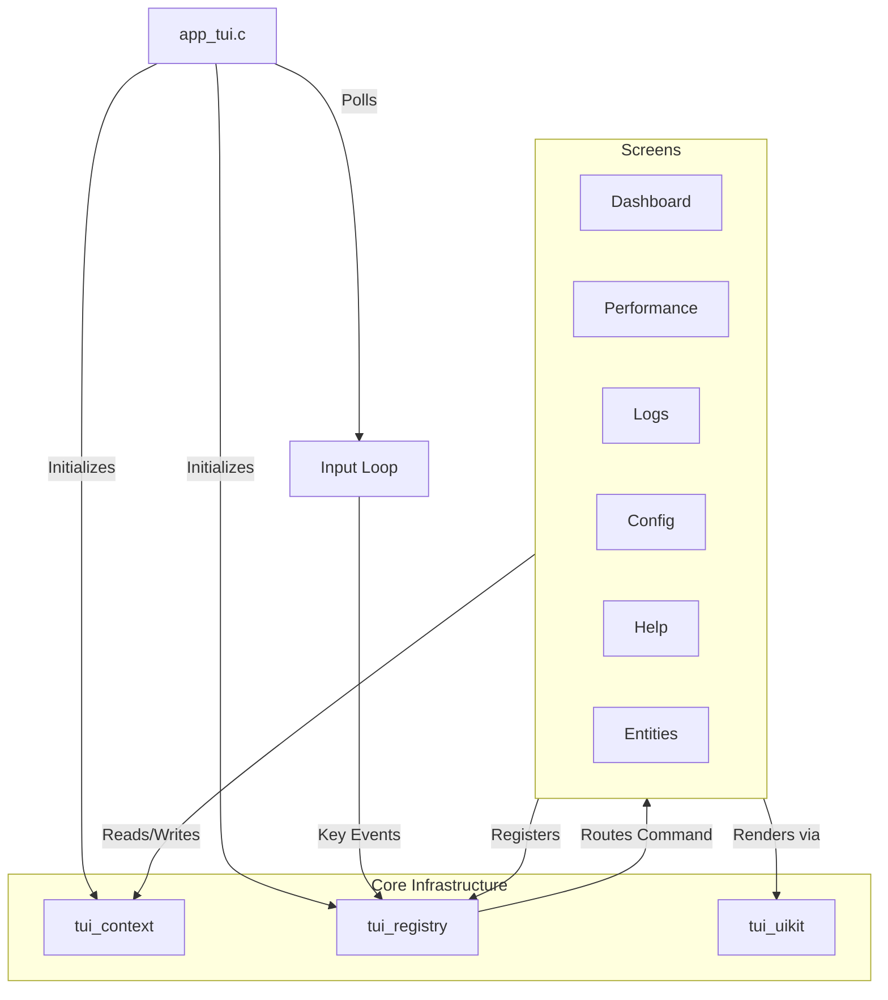

# TUI Architecture & Refactor Guide

## 1. Overview

This document describes the modern architecture of the Text User Interface (TUI) for the Post Office simulation. The system has been refactored from a global-state model to a modular, context-aware design to improve maintainability and feature scalability.

The new architecture relies on three core pillars residing in `src/core/main/tui/core/`:
1.  **Context (`tui_context`)**: Centralized, passable state container.
2.  **Registry (`tui_registry`)**: Dynamic command and input routing system.
3.  **UIKit (`tui_uikit`)**: Atomic UI component library abstracting the underlying rendering engine (Clay).

## 2. Architecture Diagram



## 3. Core Components

### 3.1. Context System (`tui_context`)

**Problem**: The legacy system relied on a global `g_tuiState` structure accessed directly by all components. This made the code tightly coupled and difficult to test or reuse.

**Solution**: The `tui_context_t` structure encapsulates the application state. It is allocated at startup and passed explicitly to screens and components.

*   **State Isolation**: Holds navigation state, cached system metrics, and input buffers.
*   **Lifecycle Management**: `tui_context_create()` and `tui_context_destroy()` manage memory allocation (including the Clay rendering arena).
*   **Future Proofing**: Designed to support multiple contexts if needed (e.g., for split-screen views or distinct simulation instances).

### 3.2. Command Registry (`tui_registry`)

**Problem**: Input handling was hardcoded in a massive `switch` statement in the main loop. Adding a new shortcut required modifying multiple files, and there was no central source of truth for the Help screen.

**Solution**: The `tui_registry` allows decentralized registration of commands and keybindings.

*   **Commands**: Defined by a unique ID string (e.g., `"nav.dashboard"`) and a callback function pointer.
*   **Keybindings**: Bind specific keys (with optional modifiers) to Command IDs within a specific `tui_binding_context_t`.
*   **Context awareness**: 
    *   `Global` bindings (e.g., F1-F8 navigation) work everywhere.
    *   `Screen-specific` bindings (e.g., `Ctrl+F` in Entities) only trigger when that screen is active.
*   **Dynamic Help**: The Help screen iterates over the registry to automatically display all available commands, ensuring documentation never drifts from implementation.

```c
// Example Registration
tui_registry_register_command("entities.filter.focus", "Focus Filter", cmd_focus_filter, NULL);
tui_registry_register_binding(CTRL_KEY('f'), false, TUI_BINDING_context_entities, "entities.filter.focus");
```

### 3.3. UIKit (`tui_uikit`)

**Problem**: Building UI layouts required verbose calls to the underlying Clay library macros, leading to "recursive soup" that was hard to read and modify.

**Solution**: The `tui_uikit` provides an atomic, domain-specific language (DSL) for common TUI patterns.

*   **Readability**: Functions like `tui_ui_header(const char *title)` or `tui_ui_button(...)` clearly describe intent.
*   **Consistency**: Enforces uniform padding, margins, and color schemes (defined in `tui_state.h` and internal logic) across the application.
*   **Abstraction**: Hides the complexity of Clay's configuration structs.

## 4. Keybinding & Input Flow

The input processing pipeline has been completely rewritten to prioritize the Registry.

1.  **Capture**: `app_tui.c` captures raw key codes from Ncurses.
2.  **Context Resolution**: The current screen logic acts as a filter to determine the `active_context` (e.g., `TUI_BINDING_context_entities` if viewing Entities).
3.  **Registry Lookup**:
    *   First, the registry checks for a match in the `active_context`.
    *   If no match is found, it checks the `Global` context.
4.  **Dispatch**: If a matching binding is found, the associated Command Callback is executed immediately.

## 5. Migration Guide for New Screens

To add a new screen to this architecture:

1.  **Define Context**: Add a new `TUI_SCREEN_NEW` enum in `tui_context.h` and a matching `TUI_BINDING_context_new` in `tui_registry.h`.
2.  **Implement Init**: In `screen_new.c`, create a `tui_InitNew()` function.
    *   Register screen-specific commands and bindings here.
3.  **Implement Logic**: Use `tui_context_t` for checking state.
4.  **Implement Render**: Use `tui_uikit` functions to draw the interface.
5.  **Map Context**: Update the switch statement in `app_tui.c` to map `TUI_SCREEN_NEW` to `TUI_BINDING_context_new`.

## 6. Conclusion

This refactor establishes a solid foundation for the TUI. The separation of concerns between state (Context), logic (Registry), and presentation (UIKit) significantly reduces technical debt and accelerates future feature development.
