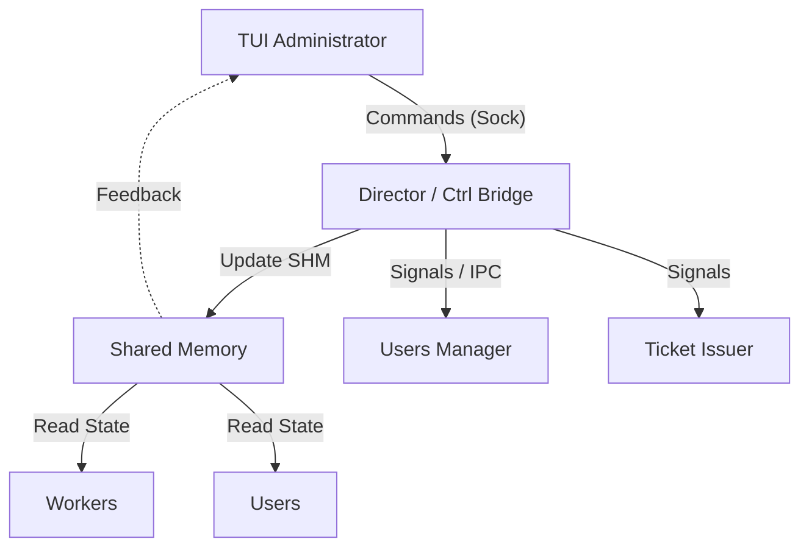

# TUI Administration & Control Report

This report outlines the strategy for implementing a comprehensive TUI Administration interface for the Post Office simulation. It details available control points, exposeable data (both existing and proposed), and the required `ctrl_bridge` enhancements to support a "God Mode" simulation controller.

## 1. System Architecture & Control Flow

The administration system will center around the **Director**, which acts as the orchestrator. The **TUI** will allow the user to send commands via the `ctrl_bridge` (socket-based) to the Director, which then modifies Shared Memory (SHM) or signals child processes to effect changes.

### Control Topology

---

## 2. Administration Capabilities (Commands)

The following commands will be exposed in the TUI, mapped to `ctrl_bridge` messages.

### A. Simulation Lifecycle
| Command | Action Description | Implementation Mechanism |
| :--- | :--- | :--- |
| **Start** | Begin the simulation clock. | Set `shm->time_control.sim_active = 1`; Signal `cond_day_start`. |
| **Pause** | Freeze time and worker actions. | Set `shm->time_control.sim_active = 0` (or new `paused` flag in SHM). |
| **Stop/End** | Graceful shutdown of all processes. | `terminate_all_simulation_subsystems()` in Director. |
| **Step** | Advance time by exactly one minute/tick. | Manual increment of `minute` in Director loop when in paused state. |
| **Reset** | Reset time to Day 1, 00:00 (Requires warm restart). | Difficult without process restart; recommend `Stop` -> `Start` cycle. |

### B. Time & Physics
| Command | Action Description | Implementation Mechanism |
| :--- | :--- | :--- |
| **Set Speed** | Adjust real-time duration of a sim-minute. | Modify `shm->params.tick_nanos` dynamically. |
| **Warp To** | Instant jump to specific Day/Hour. | Update `day/hour/minute` variables in Director loop instantly. |
| **Day Duration** | Change working hours (e.g., extend to 20:00). | Update hardcoded `8/17` constants (need to move to `shm->params`). |

### C. Population Control (Users Manager)
| Command | Action Description | Implementation Mechanism |
| :--- | :--- | :--- |
| **Set Target** | Set specific number of active users (e.g., 500). | IPC/Signal to Users Manager to update `g_target_population`. |
| **Explode** | Spawn massive number of users instantly. | Send "Surge" command to Users Manager. |
| **Clear** | Despawn all users immediately. | Set target to 0. |

### D. Chaos & Testing (New Features)
| Command | Action Description | Implementation Mechanism |
| :--- | :--- | :--- |
| **Block Service** | Force specific service type to stop processing. | Set `shm->queues[i].status = BLOCKED`. |
| **Worker Strike** | Force all workers to pause. | Set `worker_state_t` override globally. |
| **Net Lag** | Simulate network delay for Ticket Issuer. | Add artificial sleep in `ticket_issuer` request loop (needs new flag). |

---

## 3. Data Exposure (Tabs & Screens)

The TUI will ingest data primarily by mapping the **Shared Memory (SHM)** file (`sim_shm_t`) in read-only mode (or via high-frequency snapshots sent by Director if preferred for isolation).

### Tab 1: Dashboard (High Level)
*Source: `sim_shm_t`, `director_time.c`*
- **Clock**: `Day X - HH:MM` (Real-time update)
- **Status**: `RUNNING`, `PAUSED`, `STOPPED`
- **Global Stats**:
    - Total Tickets Issued (`shm->stats.total_tickets_issued`)
    - Total Served (`shm->stats.total_services_completed`)
    - Current Users (`shm->stats.connected_users`)
    - **[NEW] System Load**: Avg CPU load of Director/Main (requires specialized metric).

### Tab 2: Service Queues (Real-time)
*Source: `shm->queues[]`*
For each Service (A, B, C, D):
- **Waiting Count**: `waiting_count`
- **Throughput**: `total_served` vs Time.
- **Queue Health**: `(waiting_count / explode_threshold) %`
- **[NEW] Avg Wait Time**: Need to track `arrival_time` sum in queues to calc average.
- **[NEW] Abandon Rate**: Users who left queue without service (needs counter in `queue_status_t`).

### Tab 3: Workforce Monitor
*Source: `shm->workers[]`*
Grid view of all `N` workers:
- **ID/PID**: `pid`
- **State**: `FREE`, `BUSY`, `OFFLINE` (Color coded)
- **Current Task**: `current_ticket` (e.g., "Serving #1042")
- **Service Type**: `service_type` (e.g., "Handling Type A")
- **[NEW] Fatigue/Stress**: Mock metric increasing with time active, decreasing when paused.
- **[NEW] Efficiency**: Tickets served per simulation hour per worker.

### Tab 4: User Demographics (Deep Dive)
*Source: `users_manager` (via IPC query)*
Since `sim_shm_t` doesn't track individual user states (only aggregates), we need a new IPC query to `Users Manager`:
- **Active User List**: Sample of top 50 oldest active users.
- **State Distribution**: X% Waiting, Y% Idle, Z% Being Served.
- **[NEW] Happiness**: Aggregate score based on wait times (needs logic in `user_loop`).

---

## 4. Implementation Strategy

### Phase 1: Bridge Enhancements
1.  **Protocol Upgrade**: Expand `simulation_protocol.h` with `MSG_TYPE_ADMIN_CMD`.
2.  **Command Struct**: defining `admin_cmd_t` { `op_code`, `int_arg`, `float_arg` }.
3.  **Bridge Dispatch**: Switch statement in `bridge_mainloop.c` calling into `director_*.c` functions.

### Phase 2: Data Enrichment (The "Unexistent Data")
1.  **SHM Expansion**: Add fields to `sim_shm_t`:
    - `last_tick_duration_real_ns` (for precise speed monitoring)
    - `queue_status_s.total_wait_time_accum` (for avg wait calc)
    - `worker_status_s.tickets_served_session` (for efficiency)
2.  **Metrics Integration**: Expose `metrics_ring` to TUI or dump snapshot to SHM for TUI visualization.

### Phase 3: TUI Implementation
1.  **Input Layer**: Map keys (`SPACE`=Pause, `Right`=Step, `+/-`=Speed).
2.  **Data Layer**: `mmap` the SHM file directly for zero-latency updates.
3.  **View Layer**: Build `ncurses` or `terminal` screens consuming the mapped struct.

## 5. Proposed Next Steps
1.  **Refactor `sim_params_t`** in SHM to be mutable (remove `const` constraint logic) so `tick_nanos` can be changed runtime.
2.  **Implement `admin_cmd_t`** parser in `bridge_mainloop.c`.
3.  **Prototype TUI Dashboard** (using Python `curses` or C `tui` module) that attaches to SHM key.
